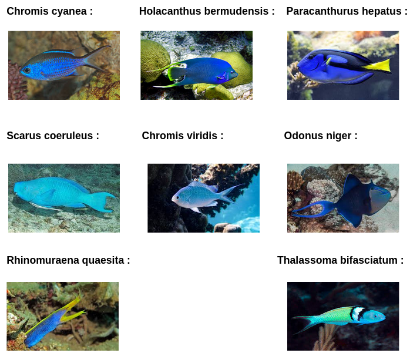
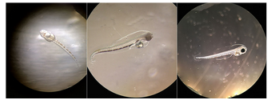
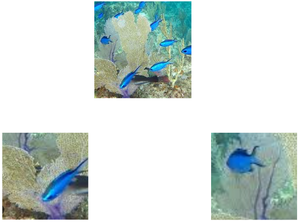

This project focuses on image classification, built upon a custom dataset. The data pipeline involved two key stages data collection and data cleaning.

## Data Collection

The dataset was acquired by scraping images from two primary sources:

* **Flickr:** Images were gathered using a the API.
* **Google Images:** This source presented a significant challenge due to its dynamic content loading.
To overcome this, a custom script utilizing Selenium this script automates a web browser and an scroll script to effectively load and dowload the required images.

## Classes Presentation

In this dataset we have 8 fish classes:

## Data Cleaning

Following collection, the raw dataset underwent a rigorous cleaning process to ensure the quality and relevance of the data used for training.

The primary cleaning tasks involved:

* **Removing blurry or low-quality images**
* **Filtering irrelevant images**
  

To ensure data quality and label precision, we enforced a specific rule each labeled image must contain only one instance of its target class.
For example, an image labeled 'Chromis viridis' is guaranteed to contain exactly one 'Chromis viridis', although other fish species may also be present in the background.

In cases where a single image contained multiple instances of the target class i performed cropping to isolate individual fish into new, separate images.

This was particularly important when the fish within the group exhibited different postures or orientations. 

This process allowed us to multiply our training data and ensure the model could learn to recognize the target species from various angles and positions.

## Model

To train the model, we tested 3 architectures: ResNet50,MobileNetV2, and a Vision Transformer with different types of preprocessing:

* RGB
* Canny edge + grayscale
* RGB + grayscale

Before training the model, we normalized the data to resize all images to a consistent size.
